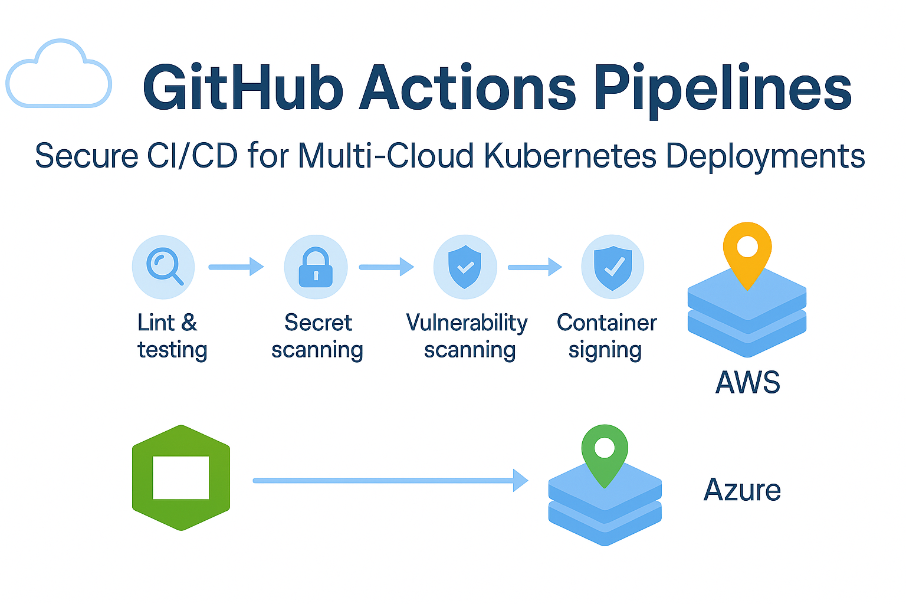

# GitHub Actions Multi-Cloud CI/CD Lab

End-to-end CI/CD pipelines deploying to **AWS EKS** and **Azure AKS** with security-by-default: OIDC, RBAC, CodeQL, secret scanning, SLSA provenance and hardened branch protections.

---

## Table of Contents

- [Overview](#overview)
- [Real-World Risk](#real-world-risk)
- [What I Built](#what-i-built)
- [Diagram](#diagram)
- [Objectives](#objectives)
- [Steps Performed](#steps-performed)
  - [0. Prerequisites & Repo Setup]
  - [1. Repo Skeleton & Sample App]
  - [2. Guardrails First (Security by Default)]
  - [3. Continuous Integration (Lint & Test)]
  - [4. Security Scanning]
  - [5. Build, SBOM, Scan, Sign & SLSA]
  - [6. Deploy to Kubernetes]
    - [6A. AWS EKS Deploy]
    - [6B. Azure AKS Deploy]
  - [7. Make It Obviously Secure]
  - [8. Cleanup]
- [Screenshots](#screenshots)
- [Lessons Learned](#lessons-learned)
- [Notes and Limitations](#notes-and-limitations)
- [References](#references)
- [Contact](#contact)

---

## Overview

This lab demonstrates a **multi-cloud, production-grade GitHub Actions pipeline** delivering a containerized app to both AWS EKS and Azure AKS. It integrates **CI, SAST, secret scanning, SBOM generation, vulnerability scanning, image signing, provenance attestation, and gated deployments**.

---

## Real-World Risk

Without automation and security guardrails:
  - Cloud deploy credentials can leak (static keys in repos)
  - Code vulnerabilities can ship undetected.
  - Malicious code could be inserted without checks.
  - Deploys may bypass review or run from unverified sources.

This project mitigates those risks with **OIDC, RBAC, enforced PR review, mandatory status checks and supply chain security**.

---

## What I Built

- Multi-job GitHub Actions workflows:
  - CI: Lint & Test.
  - Security: CodeQL, Gitleaks, TruffleHog.
  - Build, SBOM, Scan, Sign (cosign)
  - Deploy to AWS EKS & Azure AKS via OIDC.
- Secure defaults:
  - **No static cloud keys** (OIDC federation)
  - Branch protection & PR review.
  - RBAC least-privilege roles in AWS/Azure.
  - Dependency updates (Dependabot)
  - Signed commits (optional)
- Supply chain:
  - SBOM (Syft)
  - Vulnerability scan (Trivy)
  - Image signing (cosign keyless)
  - SLSA provenance.

---

## Diagram

---

## Objectives

- Build an end-to-end **secure CI/CD** flow with GitHub Actions.
- Deploy the same app to **EKS** and **AKS** with separate environments.
- Automate all scanning and signing in the pipeline.
- Enforce branch protections and environment approvals.

---

## Steps Performed

**0. Prerequisites & Repo Setup**  
   - Created GitHub repo & added minimal sample app.
   - Enabled GitHub Actions *(Screenshot: `repo_created.png`)*

**1. Repo Skeleton & Sample App**  
   - Added `app/`, `k8s/`, `.github/workflows/`, `.gitleaks.toml`, `.trivyignore`
   - Node.js HTTP server with Dockerfile & manifests for Kubernetes *(Screenshot: `github_file_list.png`)*

**2. Guardrails First (Security by Default)**  
   - Configured branch protection (require PRs, checks, linear history, signed commits).
   - Created GitHub Environments (`dev`, `staging`, `prod`) with required reviewers *(Screenshots: `branch_protection.png` & `actions_permissions_rw.png`)*

**3. Continuous Integration (Lint & Test)**  
   - Matrix test job across Node versions.
   - Caches dependencies, uploads test logs *(Screenshot: `ci_pipeline_success.png`)*

**4. Security Scanning**  
   - TruffleHog secret scans.
   - CodeQL code scanning for JS.
   - Enabled secret scanning alerts *(Screenshot: `security_codeql_success.png`, `security_trufflehog_success.png`, `security_code_scanning_trivy.png` & `security_settings_enabled.png`)*

**5. Build, SBOM, Scan, Sign & SLSA**  
   - Built & pushed image to GHCR.
   - Generated SBOM (Syft)
   - Scanned image with Trivy.
   - Signed with cosign keyless.
   - Generated SLSA provenance *(Screenshot: `ghcr_package_published.png`, `sbom_artifact.png`, `build_push_sign_success.png`, `sigstore_verification.png` & `slsa_provenance.png`)*

**6. Deploy to Kubernetes**
   **6A. AWS EKS Deploy** 
      - Created EKS cluster, OIDC role, RBAC config.
      - Helm deploy via Actions *(Screenshot: `eks_nodes_ready.png`, `step-aws-eks-role-permissions.png`, `eks_oidc_role.png`, `eks_kubectl_apply_success.png` & `eks_app_running.png`)*

   **6B. Azure AKS Deploy**  
      - Created AKS cluster, OIDC app reg, RBAC assignment.
      - Deploy manifests via Actions *(Screenshot: `aks_nodes_ready.png`, `aks_github_secrets.png`, `aks_oidc_app.png`, `aks_rbac_role_assignment.png`, `aks_helm_deploy_success.png`, `aks_kubectl_apply_success.png`, `aks_app_running.png` & `aks_app_browser.png`)*

**7. Cleanup**  
   - Deleted Azure resource group to avoid costs *(Screenshot: `azure_rg_delete.png`)*

---

## Screenshots

*All screenshots are included in the screenshots/ folder.*

| Step | Filename                          | Description                                       |
| ---- | --------------------------------- | ------------------------------------------------- |
| 0    | repo_created.png                  | New GitHub repository                             |
| 1    | github_file_list.png              | Repo structure with workflows, app, k8s manifests |
| 2    | branch_protection.png             | Initial branch protection rules                   |
| 2    | actions_permissions_rw.png        | Actions permissions set (read/write)              |
| 3    | ci_pipeline_success.png           | CI workflow passing                               |
| 4    | security_codeql_success.png       | CodeQL scan results                               |
| 4    | security_trufflehog_success.png   | TruffleHog scan results                           |
| 4    | security_code_scanning_trivy.png  | Trivy scan results                                |
| 4    | security_settings_enabled.png     | Security settings enabled in repo                 |
| 5    | ghcr_package_published.png        | GHCR package pushed                               |
| 5    | sbom_artifact.png                 | SBOM artifact in Actions run                      |
| 5    | build_push_sign_success.png       | Build and sign success                            |
| 5    | sigstore_verification.png         | Sigstore signature verification                   |
| 5    | slsa_provenance.png               | SLSA provenance job success                       |
| 6A   | eks_nodes_ready.png               | EKS cluster nodes ready                           |
| 6A   | step-aws-eks-role-permissions.png | AWS IAM role OIDC trust                           |
| 6A   | eks_oidc_role.png                 | AWS OIDC role detail                              |
| 6A   | eks_kubectl_apply_success.png     | EKS kubectl apply success                         |
| 6A   | eks_app_running.png               | EKS pods and service running                      |
| 6B   | aks_nodes_ready.png               | AKS cluster nodes ready                           |
| 6B   | aks_github_secrets.png            | AKS repo secrets in GitHub                        |
| 6B   | aks_oidc_app.png                  | Azure App Reg federated credential                |
| 6B   | aks_rbac_role_assignment.png      | Azure RBAC role assignment                        |
| 6B   | aks_helm_deploy_success.png       | AKS deploy workflow success                       |
| 6B   | aks_kubectl_apply_success.png     | AKS kubectl apply success                         |
| 6B   | aks_app_running.png               | AKS pods and service running                      |
| 6B   | aks_app_browser.png               | Browser showing app via AKS LoadBalancer          |
| 7    | azure_rg_delete.png               | Azure resource group deletion                     |

---

## Lessons Learned

- OIDC removes the need for storing long-lived cloud keys in repos.
- Enforcing branch protections early avoids risky merges.
- Combining multiple secret scanners catches more issues.
- SLSA provenance is a strong supply chain signal.

---

## Notes and Limitations

- This lab runs in public cloud; always clean up resources to avoid costs.
- Service EXTERNAL-IP provisioning in AKS may take a few minutes.
- Some screenshots use sample data; actual sensitive IDs are redacted.

---

## References

- [GitHub Actions](https://docs.github.com/en/actions)
- [AWS EKS OIDC](https://docs.aws.amazon.com/eks/latest/userguide/iam-roles-for-service-accounts.html)
- [Azure AKS OIDC](https://learn.microsoft.com/en-us/azure/aks/)
- [SLSA Framework](https://slsa.dev/)

---

## Contact

Sebastian Silva C. – August 2025 – Berlin, Germany  
- [LinkedIn](https://www.linkedin.com/in/sebastiansilc/)  
- [GitHub](https://github.com/SebaSilC)  
- [sebastian@playbookvisualarts.com](mailto:sebastian@playbookvisualarts.com)

